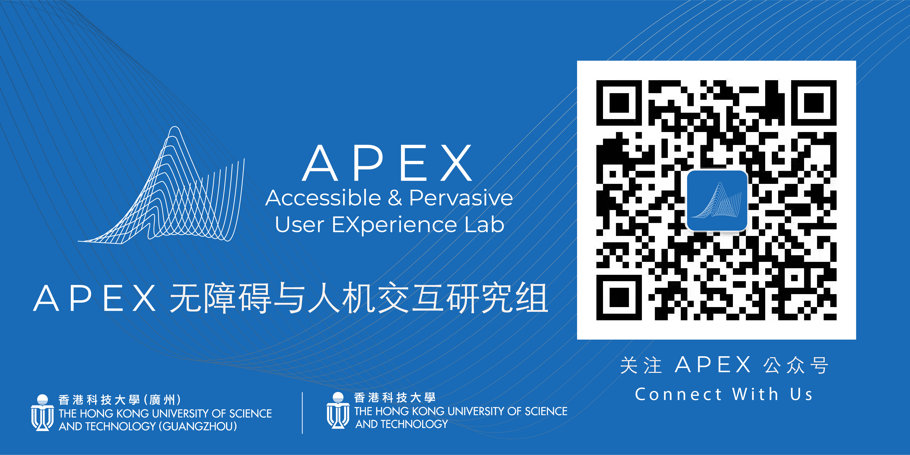

---
# A Demo section created with the Blank widget.
# Any elements can be added in the body: https://wowchemy.com/docs/writing-markdown-latex/
# Add more sections by duplicating this file and customizing to your requirements.

# widget: hero # See https://wowchemy.com/docs/page-builder/
headless: true # This file represents a page section.
weight: 10 # Order that this section will appear.
title: |
  **A**ccessible & **P**ervasive User **EX**perience   
  (APEX) Group
# hero_media: contact.jpg
design:
  # Choose how many columns the section has. Valid values: 1 or 2.
  columns: "1"
  # Add custom styles
  css_style:
  css_class:
---

 

<strong>让计算机技术更加普及和易用</strong>

 

只有当计算机技术对每个人都是可及且易用时，它才会赋予人们更多的力量。否则，计算机技术的进步将只惠及那些有特权获得它的人，从而导致网络世界不平等的加剧。因此，我们现在面临的一个挑战是：如何让计算机技术更加普及和易用，让每个人都能受益？

欢迎来到 APEX 研究组！在[范明明教授](https://www.mingmingfan.com/)的带领下，我们从以下三个方面着手解决这一问题：

- 了解**无障碍问题**，并创建新颖的**辅助技术**，特别针对为 _老年人_ 和 _残障人士_ 服务；

- 探索新的**计算用户体验（UX）方法**，通过将人类智慧与计算相结合，从而更好地检测、理解和解决 UX 问题；

- 通过创建多感官体验和新的交互技术，使**虚拟现实 VR/增强现实 AR/元宇宙 Metaverse**更易于访问。

APEX 研究组的研究成果在人机交互（HCI）和无障碍领域的顶级会议，如 ACM CHI、ACM UbiComp 和 ACM ASSETS 等会议上，荣获了最佳论文奖、最佳论文提名奖和最佳工件奖。

<!--  -->

<!-- 

{}

 -->

{}

